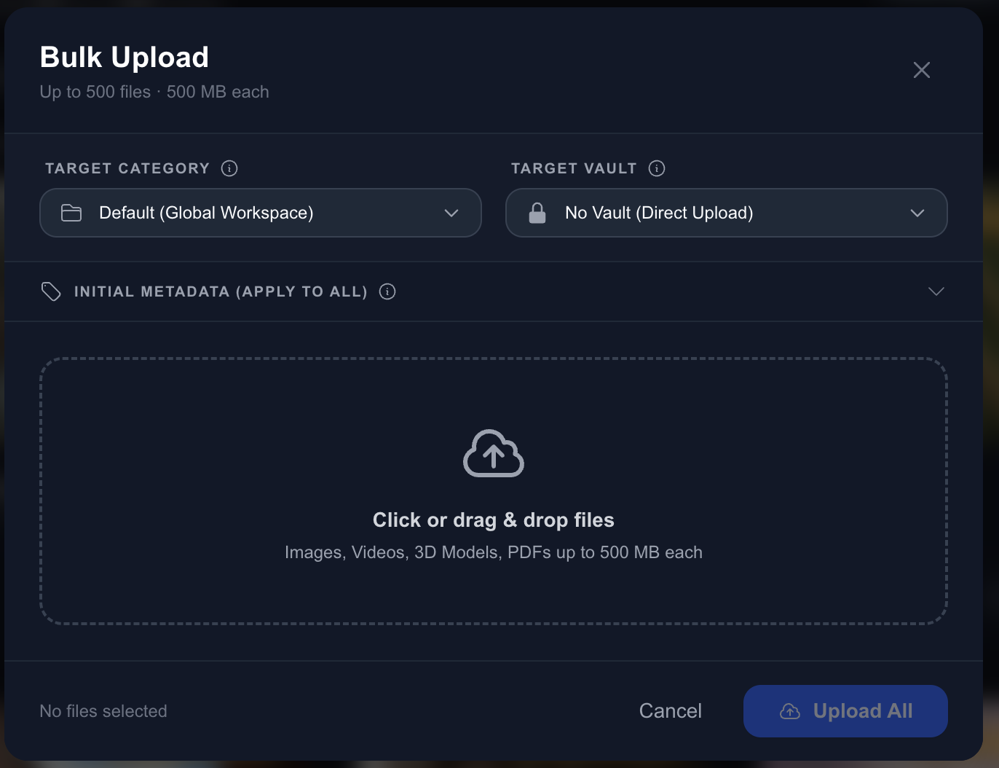

import MacWindow from '@site/src/components/MacWindow';

# Uploading Assets

Adding your files to Zuperix is simple and fast. We support a wide variety of formats, from simple images to complex 3D models.

## 🚀 Two Ways to Upload

Zuperix gives you two easy ways to get your files in:

1. **Drag and Drop**: Simply drag files from your computer and drop them anywhere on the dashboard.
2. **Upload Button**: Click the `Upload` button in the top right to select files manually.

<MacWindow url="dashboard.zuperix.com">
  
</MacWindow>

## ⚡ Scaling the Upload Pipeline

Zuperix doesn't just "receive" files; we use an **Asynchronous Upload Pipeline** designed to handle everything from tiny icons to multi-gigabyte 4K video files without timing out.

### The 3-Step Dance (Direct-to-Cloud)
To ensure maximum speed and reliability, Zuperix bypasses the central API server for the actual data transfer. Instead, we use a secure "Direct-to-Cloud" flow:

1.  **Initialize**: Your client tells Zuperix the filename, size, and type. Zuperix creates a "Pending" record and returns a **Presigned S3 URL**.
2.  **Data Transfer**: Your browser or app uploads the raw bytes directly to our secure storage (AWS S3 / Google Cloud Storage) using the presigned URL. This ensures your data doesn't "hop" through unnecessary servers.
3.  **Finalize**: Once the transfer is done, you notify Zuperix. We then kick off the **Smart AI Pipeline** (generating thumbnails, extracting colors, and AI tagging).

### 🍱 Multi-Part Uploads (Large Files)
For files larger than 100MB, Zuperix automatically switches to a **Multipart** flow. This allows your client to upload small "chunks" in parallel. If your internet drops mid-way, Zuperix only needs the missing chunks, not the whole file.

---

## 👥 No More Duplicates
Zuperix features an integrated **Auto-Deduplication** engine. 
- **Hash Matching**: Every file is uniquely identified by its cryptographic hash.
- **Save Storage**: If you upload a file that already exists in your workspace, Zuperix simply links the existing asset to your new location, saving you storage and clutter.

## 🎞️ Supported Formats

- **Images**: PNG, JPG, WebP, SVG, and TIFF.
- **Documents**: PDFs, Word docs, and presentations.
- **Advanced**: 3D models (GLB/GLTF) and high-resolution videos.

## 🕒 Tracking Progress

Uploading hundreds of items? Visit the [Upload Status Tracker](../dashboard/upload-status) to see how things are going. You can keep working in other parts of Zuperix while we process your files in the background.
