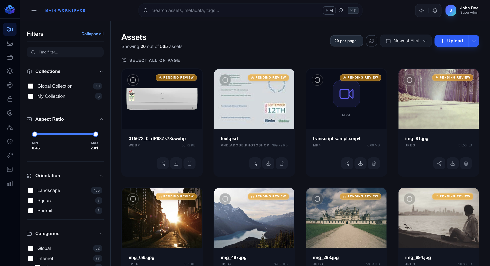

import MacWindow from '@site/src/components/MacWindow';

# Welcome to Zuperix

Zuperix is an AI-powered Digital Asset Management (DAM) system designed to help you organize, find, and share your digital treasures with ease. Whether you are a solo creator or part of a global team, Zuperix provides the tools you need to stay organized and efficient.

## ✨ Why Zuperix?

In a world overflowing with digital static, Zuperix is your signal. We don't just store files; we give them a pulse.

- **Neural Search**: Stop memorizing filenames. Speak to your library in natural language—our AI understand *concepts*, not just keywords.
- **Automated Intelligence**: Zuperix is your silent assistant, automatically tagging, deduplicating, and extracting data from every asset you upload.
- **Branded Distribution**: Share your work in high-definition, password-protected galleries (Portals) that look like a custom extension of your own brand.
- **Enterprise-Grade Security**: From SSO and Audit Logs to HMAC-signed webhooks, Zuperix is built for the scale and security of modern organizations.

---

## 🚀 Speed to Value

Ready to dive in? Here’s your 3-step roadmap to organization:

1.  **The Dashboard**: Your mission control at [dashboard.zuperix.com](https://dashboard.zuperix.com).
2.  **Upload & Process**: Experience the [3-Step Upload Pipeline](./assets/uploading) which handles files of any size with ease.
3.  **Search & Discover**: Try searching for ["a red car in the rain"](./search/smart-search) to see the neural engine in action.

<MacWindow url="dashboard.zuperix.com">
  
</MacWindow>

## Need Help?

If you ever feel lost, our [User Guide](./concepts) is here to walk you through every feature. Let's get organized!
